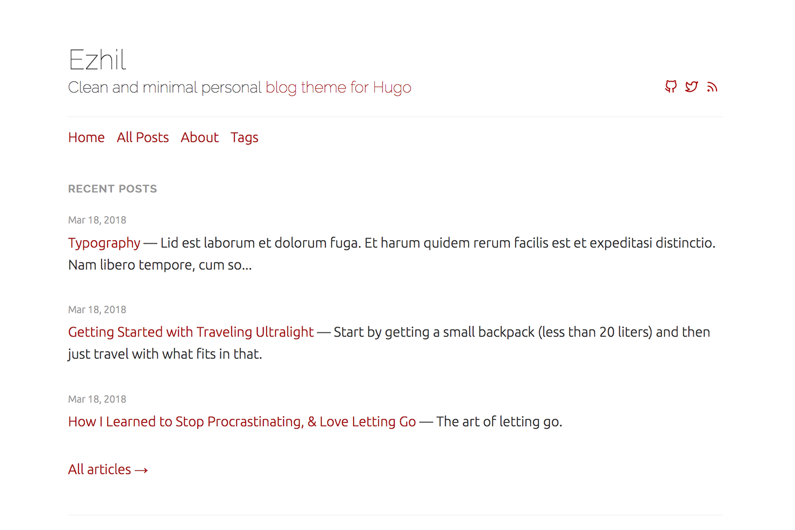

# Ezhil
Clean and minimal personal blog and portfolio theme for Hugo.

# Demo
[View demo](https://ezhil-hugo.netlify.com/)



# Features
* Clean and minimal
* Responsive
* Supports tags
* Social media links
* Google Analytics integration
* Syntax highlighting
* Twitter cards and opengraph tags support
* Disqus comments
* Hugo RSS feeds

# Installation
From your Hugo site run the following.

```sh
cd themes
git clone https://github.com/vividvilla/ezhil.git
```

For more information read the [official setup guide](https://gohugo.io/overview/installing/) of Hugo.

# Configuration
```toml
baseURL = "http://example.org/"
languageCode = "en-us"
title = "My personal blog"
theme = "ezhil"

# Enable syntax highlighting.
pygmentsstyle = "vs"
pygmentscodefences = true
pygmentscodefencesguesssyntax = true

# Your Google analytics code.
googleAnalytics = "UA-123-45"
# Your Disqus sortname.
disqusShortname = "localhost"

[params]
	# Blog subtitle which appears below blog title. Supports markdown.
	subtitle = "Clean and minimal personal [blog theme for Hugo](https://github.com/vividvilla/ezhil)"
	# Number of posts to show in recent posts list (Optional). Defaults to 10.
	recentPostsCount = 10
	# Content types which are excluded from recent posts and archive page (Optional). Defaults to ["page"]
	excludedTypes = ["page"]
	# Content types which are excludes Disqus comments (Optional). Defaults to ["page"]
	disableDisqusTypes = ["page"]
	# If social media links are enabled then enable this to fetch icons from CDN instead of hosted on your site.
	featherIconsCDN = true

# Main menu which appears below site header.
[[menu.main]]
name = "Home"
url = "/"
weight = 1

[[menu.main]]
name = "All posts"
url = "/posts"
weight = 2

[[menu.main]]
name = "About"
url = "/about"
weight = 3

[[menu.main]]
name = "Tags"
url = "/tags"
weight = 4

# Social media links which shows up on site header.
# Uses feather icons for icons. You can [search icon names from here](https://feathericons.com/).
[[params.social]]
name = "Github"
icon = "github"
url = "https://github.com/vividvilla/ezhil"

[[params.social]]
name = "Twitter"
icon = "twitter"
url = "https://twitter.com/gohugoio"

# Enable tags.
[taxonomies]
   tag = "tags"
```

# Content type
You can specify content type with field `type` in your content. For example static pages can be set as type `page` which are excluded from recent posts and all posts page. You can use site params `excludedTypes` and `disableDisqusTypes` to control which page types are excluded from recent posts and Disqus comments respectively.

```
---
title: "About"
date: 2019-04-19T21:37:58+05:30
type: "page"
---

This is some static page where you can write about yourself.
```

# Disable Disqus
You can disable Disqus from contents selectively or for all contents with certain content type. Use content field `disqus` to disable Disqus from certain contents.

```
---
title: "Content without comments"
date: 2019-04-19T21:37:58+05:30
disqus: false
---

This is a content without Disqus comments.
```

You can also disable Disqus for certain content types by using site param `disableDisqusTypes`. You can check config section above for example.

# Credits
* [Feather Icons](https://feathericons.com/)
* [Zen habits](https://zenhabits.net/) for demo content
